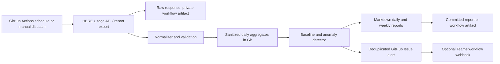

# HERE Usage Alert MVP: Implementation Plan

## Decision

Build a scheduled, repository-hosted usage monitor. A GitHub Actions workflow fetches HERE usage data once per day, normalizes it to a stable internal schema, evaluates deterministic anomalies, publishes a Markdown report, and opens or updates a GitHub issue for actionable alerts.

This is the smallest useful solution with no new infrastructure. It avoids a dashboard, hosted database, and LLM dependency in the first release.

## Assessment of the Original Proposal

The proposal has the right outcome (detect, explain, and report abnormal HERE consumption), but it overstates what can be both free and fully automated:

| Proposal item | MVP decision | Reason |
| --- | --- | --- |
| GitHub Actions scheduler | Use, subject to the repository's Actions allowance | Public repositories have different billing/privacy characteristics; private repositories consume the account's included minutes. |
| CSV history in Git | Use only sanitized, daily aggregates | Raw reports may expose application IDs, projects, or billing metadata and can grow indefinitely. |
| ML anomaly detection | Defer | It needs a representative historical baseline and provides no immediate advantage over an explainable robust statistical rule. |
| Ollama on GitHub Actions | Do not use | A local model needs a persistent compute host; hosted Actions runners are not an appropriate free inference service. |
| Grafana dashboard | Defer | Grafana needs a running host and a data store. |
| GitHub Pages dashboard | Defer | Published usage data can unintentionally disclose operational or billing information. |
| Teams webhook | Optional integration | It depends on the organization's existing Teams/Microsoft 365 entitlement and webhook governance. |
| Cost, billing tag, hourly/error dimensions | Treat as optional | Availability must be confirmed from the actual HERE Usage API/report export available to this organization. |

The MVP's root cause statement must be evidence-based: it can identify the contributing usage dimensions, but it cannot establish a deployment, leaked key, or retry storm without deployment and application telemetry.

## Scope and Success Criteria

### In scope

- A daily scheduled and manually runnable GitHub Actions workflow.
- HERE usage retrieval using a least-privilege service credential stored only in GitHub Actions secrets.
- A raw private workflow artifact and a sanitized, normalized daily dataset.
- Anomaly analysis per available usage dimension (for example, feature and application).
- A human-readable daily report, a weekly roll-up, and deduplicated GitHub issue alerts.
- Unit tests for parsing, aggregation, anomaly thresholds, and report rendering.

### Out of scope

- Hosted dashboards, chatbots, LLM-generated explanations, predictive ML models, and automated remediation.
- Claims about cost or dimensions that are absent from the HERE API response.
- Attribution of a usage spike to a root cause without corroborating telemetry.

### Definition of done

- A run retrieves the previous completed UTC day and persists normalized results idempotently.
- A run with a known spike opens one actionable alert; a repeat run updates or suppresses that same alert.
- A no-anomaly run publishes a report without creating a new alert.
- Secrets never appear in logs, committed data, reports, or artifacts intended for sharing.
- The run, report, alert, and failure path are documented in the repository README.

## Required Discovery Gate

The HERE developer documentation URLs in the original answer have moved and could not be validated automatically. Do this short API-contract spike before production code; it is the first implementation task and its result controls the rest of the schema.

1. Confirm the organization has permission to access usage data and obtain the current HERE API documentation through the Platform Portal/support channel.
2. Using a non-production credential, execute one manual request or export for a completed UTC day.
3. Record authentication method, endpoint, request parameters, pagination behavior, report latency, time zone, rate limits, and returned dimensions.
4. Save a redacted fixture under `tests/fixtures/` and map the actual fields to the canonical schema below.
5. Confirm which dimensions can be used as alert keys. Do not invent `project`, `billing_tag`, `cost`, `hour`, or `failed_api` fields if they are not returned.

**Exit criterion:** a redacted response fixture can be fetched, parsed, and reconciled against the Usage Dashboard for one date and one aggregate total. If this fails, stop implementation and resolve access/API details before building the pipeline.

## Architecture



GitHub is used for orchestration, source history, review, and alert notification. HERE remains the source of truth; the monitor does not replace the HERE Usage Dashboard.

## Canonical Data Contract

Use a narrow format that tolerates unavailable dimensions. `dimension_key` is a deterministic JSON representation of the fields that identify a usage series; it prevents collisions when one or more optional dimensions are absent.

```text
usage_date_utc,metric,quantity,unit,feature_id,app_id,project_id,billing_tag,dimension_key,source_retrieved_at_utc
2026-08-18,transactions,125000,transactions,routing,fleet-prod,,,{"app_id":"fleet-prod","feature_id":"routing"},2026-08-19T08:05:12Z
```

Rules:

- Store dates and retrieval timestamps in UTC.
- Preserve source units; do not calculate cost without an authoritative rate/card response.
- Reject negative quantities, invalid dates, duplicate series/day rows, and unexpected schema changes.
- Commit only aggregates approved for repository visibility. Keep raw JSON/CSV as a short-retention private artifact, or do not retain it at all if policy forbids it.

## Detection Design

Start with transparent, data-efficient rules rather than Isolation Forest, Prophet, or an LLM:

1. Group daily values by `metric` plus `dimension_key`.
2. Require at least 14 prior completed daily observations for a baseline; otherwise report `INSUFFICIENT_HISTORY` without alerting.
3. Calculate the median $m$ and median absolute deviation $MAD$ for the latest 30 prior values.
4. Flag a spike when both $x \geq 1.5m$ and the robust z-score $0.6745(x-m)/MAD \geq 3.5$.
5. When $MAD = 0$, alert only when $x > m$ and the absolute increase is at least a configurable minimum, avoiding divide-by-zero and tiny-volume noise.
6. Assign severity from the percentage increase and absolute increase; make these thresholds versioned configuration, not hard-coded values.

Each alert includes the observed quantity, baseline median, percentage and absolute change, sample count, affected dimensions, top contributing series, a link to the report, and bounded hypotheses such as "review recent deployment, retry, and cache telemetry." It must label hypotheses as unverified.

Initial configuration:

```yaml
history_days: 30
minimum_baseline_days: 14
minimum_absolute_increase: 1000
percentage_increase_threshold: 0.50
robust_z_score_threshold: 3.5
severity:
  warning_percentage: 0.50
  critical_percentage: 2.00
```

## Repository Deliverables

```text
.github/workflows/usage-monitor.yml       # schedule, manual dispatch, permissions
src/usage_alert/client.py                 # authenticated HERE retrieval
src/usage_alert/normalize.py              # source-to-canonical mapping
src/usage_alert/storage.py                # deterministic reads/writes
src/usage_alert/detect.py                 # baseline and alert classification
src/usage_alert/report.py                 # Markdown report rendering
src/usage_alert/notify.py                 # GitHub issue and optional webhook delivery
src/usage_alert/main.py                   # CLI orchestration
tests/fixtures/                            # redacted HERE examples
tests/                                     # unit and workflow-contract tests
data/curated/                              # approved, sanitized daily aggregates
reports/                                   # approved Markdown reports
config/thresholds.yml                      # reviewed detection thresholds
README.md                                  # setup, operations, retention, troubleshooting
```

Use Python 3.12, `pytest`, and `requests` (or the standard library HTTP client if dependency minimization is preferred). Pin dependencies with hashes or a lock file. Keep the first implementation small and modular enough that GitHub Actions and a local `launchd` job invoke the same CLI.

## Workflow and Operations

- Trigger once daily after the HERE reporting window is known to be complete; initial placeholder: `20 8 * * *` UTC.
- Also support `workflow_dispatch` with a `usage_date` input for backfills and investigation.
- Set `permissions` to the minimum required: `contents: write` only if committing aggregates/reports, `issues: write` only if GitHub Issues alerting is enabled.
- Use a concurrency group so scheduled and manual runs cannot process the same date concurrently.
- Validate and analyze before writing output. Commit all data/report changes together with a bot identity, only after validation succeeds.
- Upload redacted diagnostics on failure; never upload credentials or request authorization headers.
- Alert pipeline failures separately, because a silent failed run is more dangerous than a no-anomaly day.
- Detect schedule gaps: each report records the intended usage date and the workflow reports missing dates.

GitHub Actions scheduling is best-effort and subject to GitHub availability and plan allowances. If the account cannot use Actions at no extra cost, run exactly the same CLI daily with macOS `launchd` on an existing managed machine, with credentials in its keychain or environment managed by the organization.

## Implementation Milestones

| Milestone | Work | Acceptance check |
| --- | --- | --- |
| 0. API contract | Complete the discovery gate and add a redacted fixture. | One date reconciles to the HERE dashboard/export. |
| 1. Project skeleton | Create package, configuration, CLI, tests, lint/type commands, and secret documentation. | CLI help and test command pass. |
| 2. Ingestion | Implement auth, pagination, retry/backoff, source validation, and raw artifact handling. | Fixture and manual request normalize identically. |
| 3. Persistence | Implement idempotent canonical storage and retention rules. | Re-running a date produces no duplicate rows. |
| 4. Detection | Implement robust baseline, missing-history behavior, severity, and explainable evidence. | Synthetic normal/spike/zero-baseline tests pass. |
| 5. Reporting | Render a daily report and weekly roll-up from canonical data. | Report totals reconcile with stored aggregates. |
| 6. Alerting | Create/update deduplicated GitHub Issues; add optional Teams delivery. | Repeated spike yields one issue with updated evidence. |
| 7. Automation | Add scheduled workflow, manual backfill, concurrency, artifact retention, and runbook. | End-to-end dry run succeeds with secrets masked. |
| 8. Pilot tuning | Observe at least 30 days, review false positives, and revise config through pull requests. | Threshold changes are evidence-backed and auditable. |

## Test Plan

- Unit: API response mapping, pagination, invalid schema, duplicate rows, date boundaries, and UTC conversion.
- Unit: no baseline, steady usage, high-volume spike, low-volume noise, zero MAD, and missing dates.
- Unit: report snapshot and alert-key/idempotency behavior.
- Integration: run against a recorded redacted fixture; verify the canonical output and report totals.
- Manual acceptance: compare the selected day against the HERE Usage Dashboard/report and invoke a workflow dispatch with a known historical spike.
- Security review: verify GitHub secret masking, artifact/report content, branch protections, and least-privilege workflow permissions.

## Risks and Controls

| Risk | Control |
| --- | --- |
| Usage data arrives late or is revised | Analyze completed dates only; support backfill and retain source retrieval time. |
| API schema/dimensions differ from assumptions | Make the API-contract gate blocking and isolate mapping in one normalizer. |
| Sensitive identifiers are committed or published | Classify data first, sanitize/hash where appropriate, keep reports private, and set retention. |
| False positives after a release | Use robust thresholds, a minimum absolute change, minimum history, and configuration review. |
| Alert fatigue | Deduplicate by date/series, update an existing issue, and tune during the pilot. |
| Missed scheduled execution | Record expected dates and emit a separate pipeline-health alert. |
| "Free" platform limits are exceeded | Check GitHub plan minutes/storage and use an existing machine with `launchd` if needed. |

## Future Increments

Only after the MVP is stable and data handling is approved:

1. Add a private static dashboard generated from sanitized aggregates, or deploy Grafana only where an existing approved host and database exist.
2. Add a simple end-of-month linear forecast with backtesting before adopting heavier time-series tools.
3. Enrich anomaly reports with deployment, release, retry, and cache telemetry to support genuine root-cause analysis.
4. Add an optional local-LLM summary on an organization-managed machine. Do not send usage data to a third-party model without privacy approval.